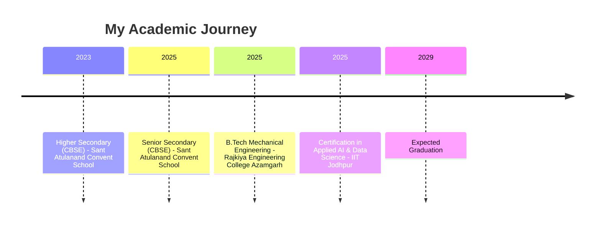

  

  
  
  
  
   
   
  

---

  <h3><i>“Building intelligent systems that matter, one line of code at a time.”</i></h3>
  
🚀 AI/ML Enthusiast | 🏆 AI Hackmatrix Champion | ☁️ AWS Certified

  <table>
    <tr>
      <td>🎓 <strong>B.Tech Mechanical Engg</strong> @ REC Azamgarh (AKTU)</td>
      <td>🤖 <strong>Certification in Applied AI</strong> @ IIT Jodhpur</td>
    </tr>
    <tr>
      <td>📍 Varanasi, India</td>
      <td>⚡ Fun fact: I can solve a Rubik's cube in under 2 minutes!</td>
    </tr>
  </table>

---

## 📚 Education Timeline

## 🛠️ Technical Arsenal

### 💻 Programming Languages
### 🤖 AI & Machine Learning
### 🌐 Web Development
### 📊 Data Visualization
### 🗄️ Databases & Tools
### 🔧 Engineering & Fabrication

*(Note: Add your badges back under these headings if you want them displayed here!)*

---

## 🏆 Featured Projects

  
  
  

### 📌 Project Highlights

🌟 <strong>Mansik Santulan — AI Mental Health Companion</strong>

 
🏆 <strong>1st Place at AI Hackmatrix, Chandigarh University</strong>  
🧠 Built an AI-powered emotional wellness platform with real-time sentiment analysis to detect emotional states from user inputs. 
📊 Designed interactive dashboards to track mood trends and behavioral patterns. 
🔒 Implemented secure architecture for handling sensitive user data.  
<strong>Tech:</strong> React, Node.js, Python, Sentiment Analysis APIs

💡 <strong>NEURAL HUB // AVX — AI Learning & Developer Assistant</strong>

 
🤖 Full-stack AI assistant that generates structured explanations for complex programming concepts. 
⚡ Integrated AI-driven responses to help developers learn faster. 
🌐 Built a responsive front-end with seamless backend query processing.  
<strong>Tech:</strong> Python, Flask, JavaScript, OpenAI API

📈 <strong>StreamFlow — Data Engineering ETL Pipeline</strong>

 
🔄 Designed an ETL pipeline to transform messy, real-world datasets into analytics-ready formats. 
🧹 Automated cleaning of missing values and inconsistent records. 
📁 Generated structured datasets for downstream machine learning tasks.  
<strong>Tech:</strong> Python, Pandas, Jupyter Notebook

### 🧩 Additional Projects
* 🍎 **Fruit Classification using WEKA** – Developed a classification model to categorize fruits based on weight, diameter, and color score.
* 💬 **NLP Chatbot System** – Built a rule-based chatbot capable of responding to user queries using natural language processing techniques.
* 🛒 **E‑Commerce Data Analytics Pipeline** – Analyzed sales datasets using KNIME and Python to identify purchasing patterns and product trends.
* 🔍 **SQL Data Analysis System** – Performed database analytics using complex MySQL queries (joins, aggregations, filtering).

---

## 🏅 Hackathon Experience

| Event | Project | Achievement |
| :--- | :--- | :--- |
| **AI Hackmatrix** @ Chandigarh University | Mansik Santulan – AI Mental Health Companion | 🥇 1st Place Winner |
| *More hackathons coming soon!* | | |

---

## 📜 Certifications & Achievements

| Badge | Description | Issuer |
| :---: | :--- | :--- |
| 🏆 | Hackathon Winner – Mansik Santulan | AI Hackmatrix |
| ☁️ | AWS Generative AI Foundations | Amazon Web Services |
| 🐍 | Python Essentials | Cisco Networking Academy |
| 📊 | Data Analytics Job Simulation | Deloitte |
| 📈 | Power BI Data Analytics Simulation | Tata Group |
| 🧠 | AWS Solutions Architecture Simulation | Amazon Web Services |
| 🏦 | Introduction to Data Science Simulation | Commonwealth Bank |
| 🎓 | GitHub Student Developer Pack Recipient | GitHub |

---

## 📊 GitHub Analytics

  
  

 

  

---

## 🌱 Current Focus

* 🔭 Building end‑to‑end ML projects with deployment on cloud.
* 🌱 Deep diving into **Generative AI** & **Advanced NLP**.
* 📘 Taking **AWS Cloud Practitioner** certification (in progress).
* 👯 Open to collaborate on **AI/ML open‑source** projects.
* 💬 Ask me about **Python, hackathons, or data science**.

---

## 🎯 Interests & Hobbies

🤖 Artificial Intelligence · 🏭 Machine Learning · 🌐 Full Stack Development · 📊 Data Science · 🚀 Tech Startups · 🧩 Hackathons · ♟️ Chess · ✈️ Travel · 🎮 Strategic Gaming

---

## 📬 Let's Connect!

  
  
  
  

